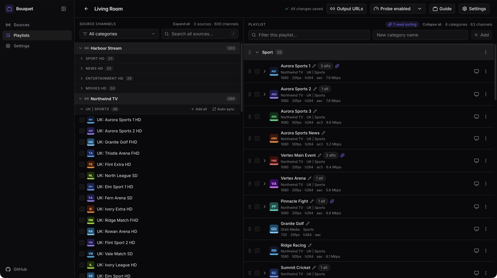
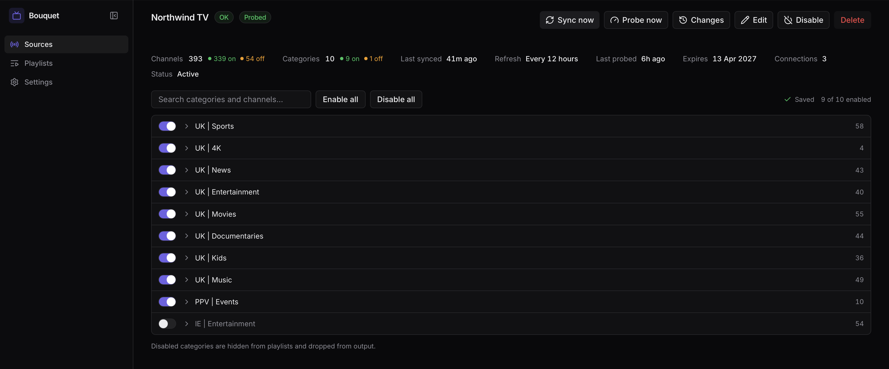
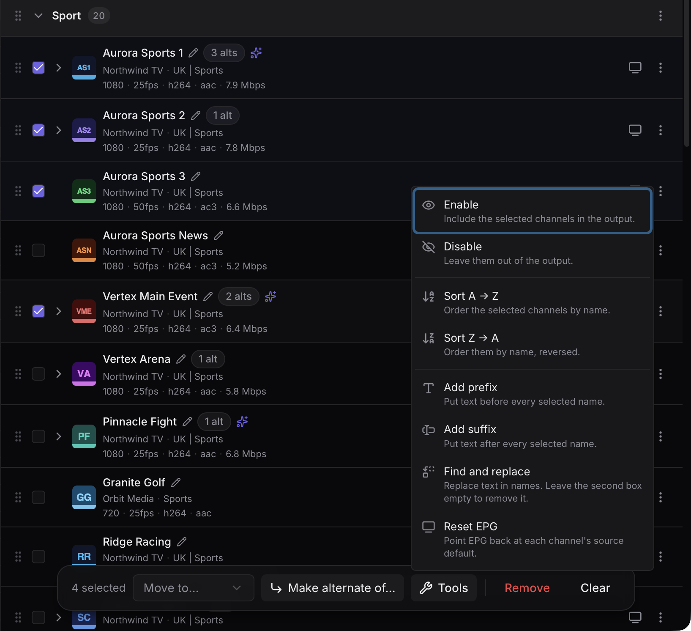
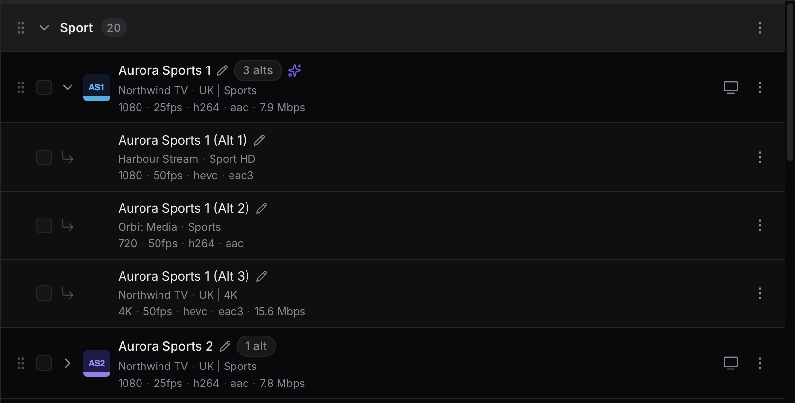
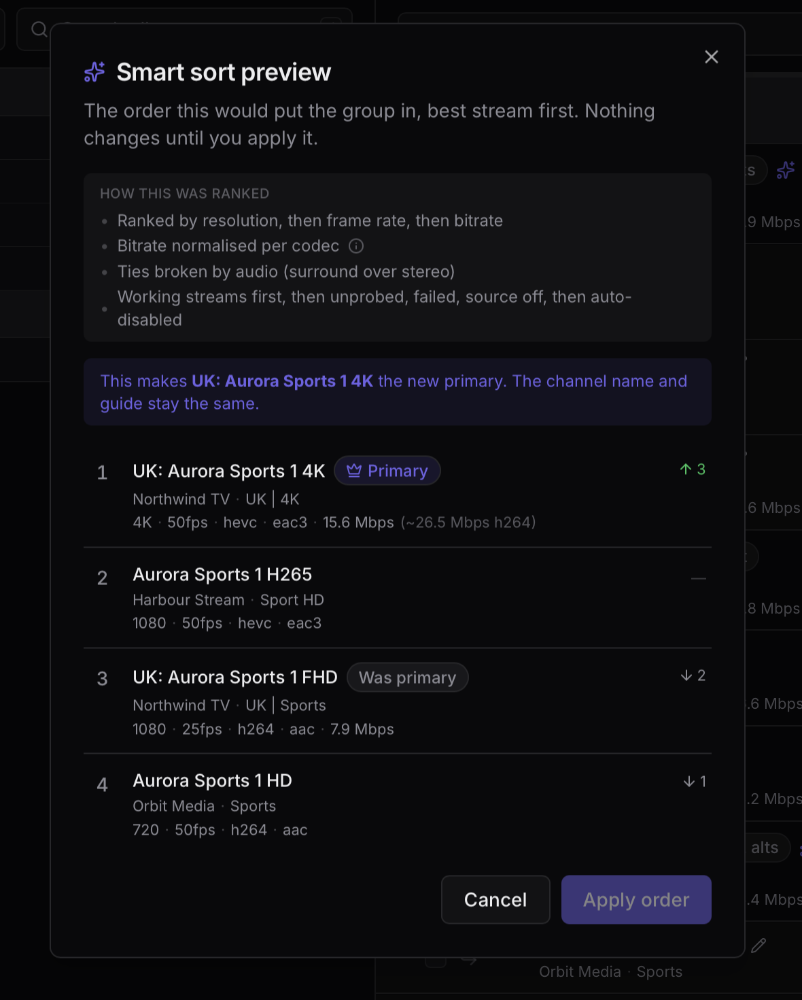
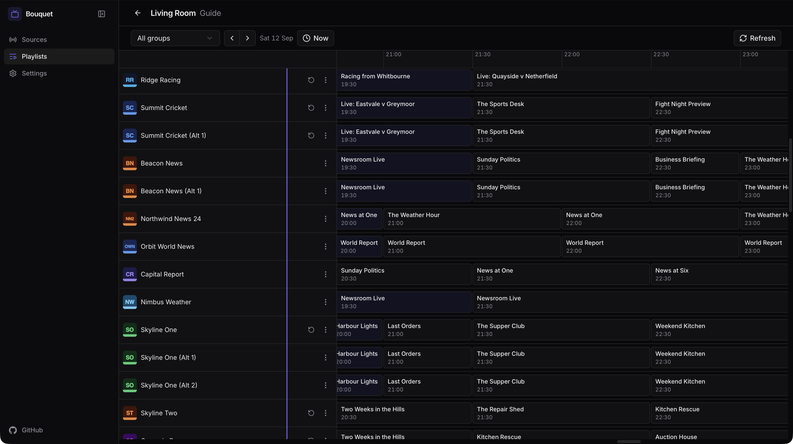
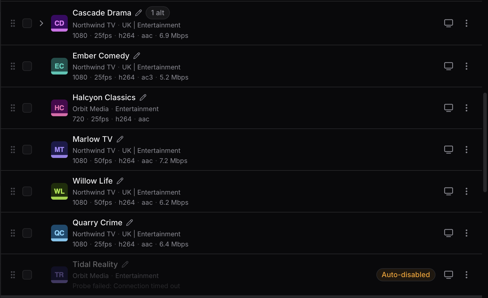

# Bouquet

Bouquet is a self-hosted playlist manager for IPTV. Add your providers, pick the
channels you want, and it builds an M3U playlist and a matching XMLTV guide for
your player to load.

A provider hands you a few thousand channels in whatever order suits them, and
people often have more than one provider. Bouquet merges them into a list you
choose, and keeps it current as the providers change theirs. It isn't a proxy,
the video never passes through it, the M3U points at your provider's own stream
URLs.



## Quick start

```sh
docker compose up -d
```

Then open http://localhost:3000 and add a source.

There is no auth yet, so run it on a private network.

## Features

### Sources

A source is one provider account, over the Xtream Codes API that most providers
hand out. Bouquet pulls down the channel list, categories and guide data. Plain
M3U sources aren't planned, but a PR would be welcome.

- Each source refreshes on its own schedule, or when you hit sync
- Your playlist edits survive a refresh, even if the provider renames the channel
- Channels the provider drops stay put, marked as gone
- Every sync keeps a list of what was added, removed, renamed or taken offline
- Shows when the account expires and how many streams it allows at once
- Turn categories off, and choose whether new ones come in automatically



### Playlist editor

A playlist is a channel list you build yourself. You can have as many as you
want, each with its own categories, order and output URLs, so different devices
can point at different playlists.

- Each playlist can mix channels from as many providers as you like
- Your own categories, drag and drop ordering, renaming, custom logos
- Bulk tools: move, enable/disable, sort, prefix and suffix, find and replace
- Point a channel's guide data at another channel and it takes that logo too
- Group a channel with its backups as [alternate channels](#alternate-channels)
- An auto-sync group is a category that mirrors a provider's own category, so
  its contents change when theirs do. Suits Pay Per View



### Alternate channels

The same channel usually shows up more than once: on a second provider, as
several feeds within one provider, or in different qualities. An alt is one of
those extra copies, grouped under a primary channel.

Nothing automatic happens. Each alt is still its own channel in the M3U, named
after the primary, like "BBC One (Alt 1)". Your player won't fail over, you pick
the next one yourself. The naming template lives in the playlist's settings and
can also include the alt's provider name, or just its first letter, so you can
tell at a glance which provider a backup comes from. There's a matching template
for every other channel, so the primary can say which provider it's on too.

- Alts take the primary's name, logo and guide data, so renaming the primary
  renames the group
- Promote an alt to primary at any time
- [Smart Sort](#smart-sort) ranks a group on [probe](#probing) data and promotes
  the best one



#### Smart Sort

Once you've [probed](#probing) a group, Smart Sort puts the best stream first and
makes it the primary. It compares resolution, then frame rate, then bitrate,
using surround sound to break a tie, and drops anything broken to the bottom.
Bitrate is normalised for the codec first, since a better codec looks the same at
a lower bitrate. You get a preview before anything moves, and only the running
order changes, the name and guide stay put.



### Guide and playback

- A TV guide per playlist, scrollable backwards and forwards
- Catchup, so you can replay a programme that's already been on, where the
  provider offers it
- Open a channel or past programme in VLC, or copy its URL



### Probing

Providers label channels FHD, UHD and so on, and the label is often wrong.
Probing opens the stream with ffprobe and records what the stream actually is.

- Resolution, frame rate, codecs and bitrate, shown next to the channel
- On a schedule per source, or on demand
- Probe a whole playlist, only the missing or failed ones, one category, or one
  alt group
- Bitrate means downloading a few seconds of the stream, so it's off by default.
  It's slow
- Some dead channels serve a perfectly valid black screen. Bouquet decodes a few
  seconds and marks those failed (on by default)
- Channels that keep failing get switched off, promoting a working alt first



### Output

Each playlist has two URLs, the M3U channel list and the XMLTV guide. Point your
player at those.

- Neither needs a login, since players can't sign in
- TS or HLS streams, picked per source
- Rebuilt when a source syncs or you edit the playlist
- Can also be pushed to [external storage](#upload-destinations)

### Upload destinations

Those two URLs only work while Bouquet is reachable. A playlist can also push
both files somewhere else and have the player point there.

- S3 or anything S3 compatible (R2, MinIO, B2, Wasabi), or a local folder on the
  server
- Runs after a source syncs, or on demand
- Give it the destination's public URL and the uploaded playlist links to the
  uploaded guide

An M3U carries your provider login in its stream URLs, so treat an uploaded one
as sensitive.

### Operations

- Backup and restore, on a schedule or by hand
- Works on desktop and mobile

## Configuration

| Env            | Default     | Purpose                                                               |
| -------------- | ----------- | --------------------------------------------------------------------- |
| `CONFIG_PATH`  | `./data`    | Directory for the database and backups                                |
| `SYNC_CRON`    | `0 * * * *` | How often the sync check runs (each source syncs on its own interval) |
| `PROBE_CRON`   | `0 * * * *` | How often the stream probe check runs                                 |
| `BACKUP_CRON`  | `0 3 * * *` | Schedule for backups                                                  |
| `BACKUP_KEEP`  | `14`        | Scheduled backups to keep                                             |
| `FFPROBE_PATH` | `ffprobe`   | Path to the ffprobe binary                                            |
| `FFMPEG_PATH`  | `ffmpeg`    | Path to the ffmpeg binary                                             |
| `PORT`         | `3000`      | Server port                                                           |

Migrations apply automatically on startup.

## Develop

```sh
npm install
npm run dev
```

The SQLite file lands at `./data/bouquet.db`.

- `npm run build` — production build
- `npm run start` — run the production server (`server.js`)
- `npm test` — run the tests
- `npm run typecheck` — typegen + tsc
- `npm run db:generate` — generate a migration after changing the schema
- `npm run db:migrate` — apply migrations
- `npm run db:studio` — open Drizzle Studio

Most of this was written with [Claude](https://claude.com/claude-code), with a
human reviewing every change before it lands. Treat it like any other code: read
it, test it, and open an issue if something looks off.

## License

MIT.
